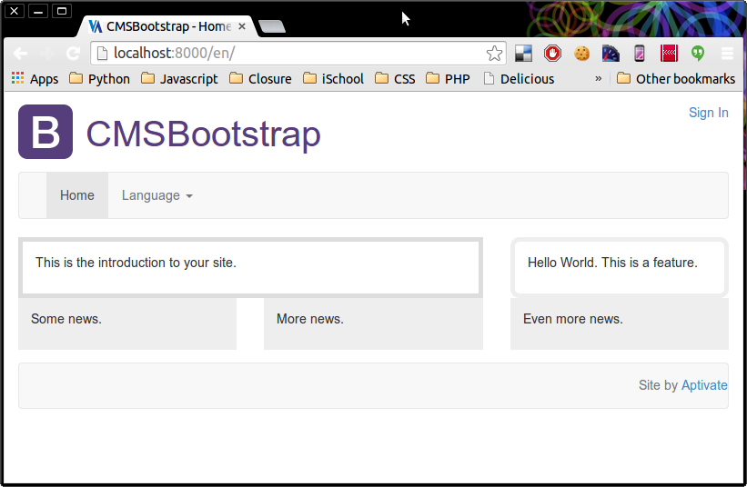
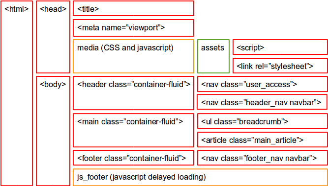

# cmsbootstrap

Django-CMS extensible basic theme with Bootstrap to get you started quickly.

## Purpose

Django-CMS is very powerful, but comes with no themes by default.
[They say](https://groups.google.com/d/msg/django-cms/4oxF9goRk2g/WEPLSk7OzdYJ):

> Themes are outside the django CMS scope. If you wish to theme the admin,
> just override the template `admin/base_site.html` and include some custom css.

That's all very well, but everyone wanting to start a new project with
Django-CMS faces a lot of study, effort and difficult choices just to get
their first pages to display sensibly. CMSBootstrap aims to get you started in
minutes, with a quality extensible base to build your site on.

## Philosophy

CMS Bootstrap aims to:

### Work with Django-CMS

Themes for non-CMS projects are out of scope.

### Work out of the box

Provide a reasonable basic theme for a Django-CMS site automatically,
out of the box, with no effort.

### Use Bootstrap

Use the Bootstrap project to provide a sensible default theme (toolkit)
that you can pull bits from when you need them, without getting in your way.

### Be reasonably extensible

Make the simple things simple, and the hard things possible. Changing
colours, fonts and sizes should be easy with SCSS.

To that end, we use the
[Sass/SCSS version of Bootstrap](http://getbootstrap.com/getting-started/#download-sass)
so that you can quickly enable and disable modules and change colours.

### Be lightweight

Low bandwidth accessibility is a big part of our philosophy, and this theme
needs to support that. Using Bootstrap/Sass allows us to enable and disable
Bootstrap modules quickly, so we can skip large chunks of CSS and keep the
overall page weight small, while still being flexible.

Our goal on our first project is to keep our pages below 100 kB compressed,
including images, CSS and javascript. This allows them to be loaded within
10 seconds on an 80 kbps connection. Standard Bootstrap CSS alone is 99 kB
(bootstrap-3.1.1-dist/css/bootstrap.min.css), which leaves no room for anything
else on the page within our budget!

### Be reusable

This is related to being extensible, but often in conflict. For example:

To be extensible, a theme needs a lot of hooks to override in subclasses:
Django template blocks, CSS classes applied to elements, etc. But all the
hooks that you're not using are noise that clutters and bloats your pages,
so a page full of hooks is a poor template to copy and modify in your own
code, at least not without ripping out a lot of code.

So our aim is to have *likely* extension points, but not *every possible*
one. Other reuse mechanisms such as:

* Importing existing files wholesale
* Extending (importing and then overriding) existing files
* Reusing a block's contents, but adding to it
* Replacing a file completely
* Disabling a file

should all be supported and used where possible in preference to cluttering
every template with every possible extension point.

### Be maintainable

For the same reason, our "API" to developers should be clear, simple, and
stable: unlikely to change, or need to be changed in future to support newer
versions of Django, Django-CMS, Bootstrap, etc.

This allows developers using CMSBootstrap in their projects to upgrade to the
latest version (for example, if there is a security vulnerability in the CSS,
or to support a newer version of Django) with minimal risk that it will break
their projects and require extensive repair.

### Be portable

As well as slow and unreliable connections, our philosophy is that websites
should be accessible:

* Using old browsers (e.g. Internet Explorer 8) for those without bandwidth,
  skills or permission to upgrade their browsers.
* Using mobile devices (smart phones, feature phones, low cost tablets) as well
  as desktop PCs. So our designs should be responsive, compatible with
  older and simpler browsers such as Opera Mini, and not require Javascript.
* Using free software (Linux, Firefox, Chromium etc.) as well as Windows,
  Internet Explorer and Flash, to access our websites.
* By people using assistive technology (screen readers etc.)
* Into the future, by using web standards properly. So we use HTML5 elements
  such as `header` and `nav` elements, and add backwards compatibility in
  IE8 using Javascript.

Where these standard conflict, we aim to support the largest possible number
of users in our target audience.

### Use Django-Assets

We use [django-assets](https://github.com/miracle2k/django-assets) to
automatically compile Sass/SCSS to standard, minified CSS. It will make your
life better, so we think you should use it too.

You can manually compile the Sass files to standard CSS if you really want to.

## Contents

The Github project contains the following files and directories:

* cmsbootstrap: the app which you can add to `INSTALLED_APPS` in Django.
  * models.py: an empty models file to keep Django happy.
  * static: static resources: Sass/SCSS, CSS and JavaScript.
    * bootstrap-sass-3.1.1.tar.gz: the complete sources for
      the supplied version of Bootstrap (in Sass/SCSS format).
    * cmsbootstrap: CSS and JavaScript files:
      * ie7.css: Internet Explorer 7
        compatibility CSS library (minimal, just for the included styles).
      * ie8.css: Internet Explorer 8
        compatibility CSS library (minimal, just for the included styles).
      * html5shiv.js, lte-ie7.js, respond.min.js: compatibility
        libraries for Internet Explorer 8 (responsive media queries and HTML5
        elements).
    * js/bootstrap.js, js/bootstrap: the JavaScript libraries supplied with
      Bootstrap.
    * sass/bootstrap: Bootstrap Sass/SCSS source files.
    * sass/cmsbootstrap.scss: a few additional styles in Sass/SCSS format.
  * templates: the supplied templates, described in detail below.
  * tests: test cases for cmsbootstrap, may be affected by
    your own application choices (e.g. changing URLs, languages or pages.)
  * views.py: no views are currently provided.

## Usage

### With DYE

If you don't yet have a Django-CMS project, the easiest way to get started is:

* [use DYE and cookiecutter](https://github.com/aptivate/dye/blob/develop/readme-cookiecutter.rst)
  to create one,
* enter `cms` for the *Project type*.

Whether this is a new or an existing DYE project, add `cmsbootstrap` to it:

* add this line to `deploy/pip_packages.txt`:
    -e git+https://github.com/aptivate/cmsbootstrap.git
* run `deploy/bootstrap.py`,
* run `deploy/tasks.py deploy:dev`.

### Manual Installation

If you're not using DYE, then install `cmsbootstrap` in your global Python
environment or virtualenv:

    pip install cmsbootstrap

Or if it's not available on PyPI, or you need a newer version:

    pip install -e git+https://github.com/aptivate/cmsbootstrap.git

Of course you need [Django](https://www.djangoproject.com/)
(1.5 or higher) and
[Django-CMS](https://www.django-cms.org/en/) (2.4 or higher) in your
environment as well. They'll be installed automatically by Pip if you don't
have them already.

### Add to `INSTALLED_APPS`

Add `django_assets` and `cmsbootstrap` to your INSTALLED_APPS setting like this:

    INSTALLED_APPS = (
        ...
        'django_assets',
        'cmsbootstrap',
    )

This allows Django to find the templates and static files that we've provided.
Add `django_assets.finders.AssetsFinder` to your `STATICFILES_FINDERS`:

    STATICFILES_FINDERS = (
        'django.contrib.staticfiles.finders.FileSystemFinder',
        'django.contrib.staticfiles.finders.AppDirectoriesFinder',
        'django_assets.finders.AssetsFinder',
    )

This allows `django-assets` to find the assets and compile them.
Ensure that you have the `LocaleMiddleware` enabled in your `MIDDLEWARE_CLASSES`:

    MIDDLEWARE_CLASSES = (
        # other middleware ...
        'django.middleware.locale.LocaleMiddleware',
    )

Some of our templates use the `request.LANGUAGE_CODE` context variable, which
requires LocaleMiddleware.

You'll need to add some templates too. You don't need all of these, but you
probably want at least one simple page design, a custom home page, and the
global placeholders.

    CMS_TEMPLATES = (
        ('custom/page_1col.html', 'Simple Page (no sidebars)'),
        ('custom/page_3col.html', 'Simple Page (both sidebars)'),
        ('custom/page_3col_notitle.html', 'Simple Page (without title, for plugins)'),
        ('custom/homepage.html', 'Home Page'),
        ('custom/placeholders_extra.html', 'Global Placeholders'),
    )

### Configuration for Crispy Forms

Although not required by CMSBootstrap itself, you might want to add this
setting so that you'll be ready if you decide to start using
[Crispy Forms](http://django-crispy-forms.readthedocs.org/en/latest/)
(recommended) in your project at some point:

    CRISPY_TEMPLATE_PACK = 'bootstrap3'

### Add django.contrib.auth URLs

The standard template has login and logout buttons, for which you need to have
the `django.contrib.auth.urls` URL patterns installed somewhere in your URL
map. Otherwise you'll get an error:

> NoReverseMatch at /en/
>
> Reverse for 'login' with arguments '()' and keyword arguments '{}' not found. 0 pattern(s) tried: []

If you get this error message, you can add the following lines to your project's
`urls.py` to resolve it:

    import django.contrib.auth.urls
    urlpatterns += patterns('', url('', include(django.contrib.auth.urls)))

### Building the assets

You'll have to build the assets (CSS files) from the Sass sources at least
once:

    django/website/manage.py assets build

Or you can run the following command, in a spare terminal, to watch the sources
for changes and rebuild them automatically when necessary:

    django/website/manage.py assets watch

### Creating a superuser

If you don't have one already, you'll need a superuser to log into the
Django-CMS admin. You can create one like this:

    django/website/manage.py createsuperuser

And run the development server (in a spare terminal):

    django/website/manage.py runserver

You should be able to access http://localhost:8000/ and see the Django-CMS pony
or welcome page.

### Starting your site

If you haven't used Django-CMS before, we recommend that you start with the
[tutorial](http://docs.django-cms.org/en/2.4.3/getting_started/tutorial.html).

You need some Django-CMS pages to see the templates. If you don't have any,
then you'll just see the Django-CMS pony when you visit your site at
http://localhost:8000/.

Creating pages is not really in the scope of this documentation. You could 
follow the [Creating your first CMS Page](http://docs.django-cms.org/en/2.4.3/getting_started/tutorial.html#creating-your-first-cms-page)
part of the tutorial. Or, if you just want to get started quickly, you can
import the `homepage` fixture to get a simple home page into your CMS (you
can then customise or delete it as you wish):

    django/website/manage.py loaddata homepage

## Customisation

### About Django templates

In Django you can reuse templates by:

* overriding a template file, by placing a file with the same name and path
  in the `templates` directory of one of your own apps.
* extending a template file, by creating a file with a *different* name that
  starts with ``.

Note that you cannot both **override** and **extend** the same file. Overriding
a file hides the original file, so you can no longer access it or inherit from
it.

Therefore we inserted some extra layers into the inheritance hierarchy: the
templates in the `custom` directory. They extend the real templates from the
`cmsbootstrap` directory, and make no changes by default. You can copy them
into your own app (with the same directory name, `custom`), thus overriding
the ones in CMSBootstrap. Note that:

* `custom` templates extend the **eponymous** template in `cmsbootstrap`.
* `cmsbootstrap` templates extend a parent template in `custom`.

### Django-CMS page templates

Because Django-CMS stores the actual filename of the template file in
the database, you do not want to move templates around. Therefore the `custom`
templates serve another function: you can use them in your `CMS_TEMPLATES`
list instead of the CMSBootstrap versions, and get a default implementation
from `cmsbootstrap` that does nothing.

When you want to change the template in your project, create a
`custom/homepage.html` (for example) in one of your apps (perhaps by copying
the one from CMSBootstrap) and override some of the blocks that it inherits
from `cmsbootstrap/homepage.html`.

## Included templates

Note that each template appears in two directories, `cmsbootstrap` and
`custom`, as described above.

It's recommended that you read the template files to discover all the
customisations that are possible. Only a few are listed here.

### base.html

This is the base template which includes most of the HTML structure to build
a basic website out of Bootstrap:

Elements that you're likely to remove or replace completely are wrapped in
template blocks with the same name as the element or its CSS class:

* `viewport`: `<meta name="viewport">`
* `media`: all CSS and Javascript. You can override this to add CSS and
  early-loading JavaScript if you don't want to use assets.
* `header`: `<header class="header_site container-fluid">`
* `logo`: the default/dummy CMSBootstrap logo.
* `user_access`: `<nav class="user_access">`
* `user_login_links`: `
`
* `header_nav: HTML5 `<nav>` element:
  `<nav class="cmsbootstrap_header navbar navbar-default">`,
  a Bootstrap navbar for top navigation.
* `header_nav_brand`: empty by default, you can override this to include your branding inside the header navbar
  instead of above it.
* `header_nav_menu`: the Django-CMS top-level menu: 
* `language_menu`: the Django-CMS language chooser
* `main`: HTML5 `<main>` element: `<main class="container-fluid">`
* `breadcrumb_wrap`: the wrapper for the Django-CMS breadcrumbs element
* `article`: HTML5 `<article>` element: `<article class="main_article">`. You can
  override this to add left and right sidebars inside `<main>`, as the
  page_3col_notitle.html template does.
* `content`: empty by default, you can override this to hold your pages' main
  content, placeholder or application.
* `footer`: `<footer class="cmsbootstrap_footer container-fluid">`
* `js_footer`: loads most JavaScript assets. You can override this to add
  late-loading JavaScript in pages if you don't want to use assets.

### homepage.html

An example home page with image rotator with a few image blocks.

### page_3col_notitle.html

An example three-column layout with no page title.

### page_3col.html

Extends page_3col_notitle.html and adds a title.

### page_1col.html

Extends page_3col_notitle.html, adds a title and removes the sidebars.

### placeholders_extra.html

This template exists so that you can add static content that appears on
multiple pages (headers, footers, etc.) and edit it using the Django-CMS
front end.

To do that, create a page (just one!) using this template, with the reverse_id
`placeholders_extra`, and populate the placeholders in it with your static
content.

To add new placeholders, override this page and add some new placeholders:

    

And then include it in your other templates somewhere:

    

### cmsbootstrap/menu/menu.html

Renders a Django-CMS menu item in a way that works with Bootstrap Navbar.

### cmsbootstrap/menu/language_chooser.html

Renders a Django-CMS menu item in a way that works with Bootstrap Navbar
as a subitem of the Language item dropdown.

### cmsbootstrap/menu/breadcrumb.html

Renders a Django-CMS breadcrumb item in a way that works with the standard
breadcrumb list.

### base.html

In addition there is another template file called `base.html` above the
`cmsbootstrap` directory, which is just an adaptor for `404.html` and
`500.html` in [DYE](http://github.com/aptivate/dye), and is not used otherwise.

### CSS classes

Many elements have CSS classes to help you target them:

* <html>
  * Some classes to help you write browser-specific CSS using conditional comments:
  * `ie ie6` if the user's browser is Internet Explorer 6
  * `ie ie7` if the user's browser is Internet Explorer 7
  * `ie ie8` if the user's browser is Internet Explorer 8
  * `ie ie9` if the user's browser is Internet Explorer 9
  * `non-ie` if the user's browser is not Internet Explorer (or IE >= 10)
* <body>
  * `slug_`<Django_CMS slug for the current page>, e.g. `slug_home`, `slug_about`.
  * `lang_`<the current language code>, e.g. `lang_en`
  * `template_`<a name for the current template>, e.g. `page_1_column`, `page_3_column_notitle`.
  * all wrapped in a `body_classes` block to allow you to override them.
* <header>
  * `cmsbootstrap_header` (also carried by <nav>, so you need to target `header.cmsbootstrap_header`)
  * `container-fluid` to enable Bootstrap fluid rows to be placed inside.
  * all wrapped in a `header_classes` block to allow you to override them.
* <nav> (login links)
  * `user_access`
* <nav> Bootstrap top navbar
  * `cmsbootstrap_header` (also carried by <header>, so you need to target `nav.cmsbootstrap_header`)
  * `navbar` and `navbar-default` to get Bootstrap Navbar styling
  * all wrapped in a `header_nav_classes` block to allow you to override them.
* <main> (the main content part of the page, between header and footer)
  * container-fluid (Bootstrap layout)
  * wrapped in a `main_classes` block to allow you to override it.
* <article> (the main content part of the <main> element, between any sidebars)
  * `main_article`
  * just override the `article` block if you want to change the classes.
* <footer>
  * `cmsbootstrap_footer`
  * `container-fluid`
  * all wrapped in a `footer_classes` block to allow you to override them.

## Assets

You can import the assets from `cmsbootstrap.assets` into your own assets
module and add extra files to combine them into a single asset, minified and
compressed, to avoid creating extra HTTP requests, like this:

	import cmsbootstrap.assets as cmsbootstrap
	myapp_css = Bundle(
	    cmsbootstrap.common_css,
	    'sass/myapp.scss',
	    filters='pyscss, cssmin',
	    output='css/myapp/my.min.css')
	register('myapp.myapp_css', myapp_css)

To avoid including the standard CMSBootstrap files a second time, you'll want
to override the `standard_css` block, replacing its contents with your own
asset, in the `base.html` template:

	
		
		    <link rel="stylesheet" href="{{ ASSET_URL }}" />
		
	

### Adding SCSS styles

You can add new Sass/SCSS assets by following the
[django-assets documentation](http://elsdoerfer.name/docs/django-assets/),
creating an `assets.py` file. For example, you could create a `main/assets.py`
like this:

	from django_assets import Bundle, register

	main_css = Bundle(
	    'sass/main/main.scss',
	    filters='pyscss, cssmin',
	    output='css/main/main.css')

	register('main_css', main_css)

And create `main/static/sass/main/main.scss` with whatever additional
Sass/SCSS you'd like to include, for example:

	@import "bootstrap/bootstrap";

	.nav-text {
	    padding: $nav-link-padding;
	}

Because you've imported the `bootstrap.scss` from `cmsbootstrap`, which in turn
imports `variables.scss`, you have access to all the variables defined by it,
such as `$nav-link-padding` used above.

Then you need to include the generated CSS file in your `base.html`:

	
		{{ block.super }}
		<link rel="stylesheet" href="{{ STATIC_URL }}css/main/main.css" />
	

### Changing Bootstrap variables and values

If you want to make changes to these variables, without copying all of the
`cmsbootstrap` Sass files into your own app, you can add the `cmsbootstrap`
project directory to `PYSCSS_LOAD_PATHS` in `settings.py`:
	
	PYSCSS_LOAD_PATHS = (
	    path.join(path.dirname(__file__), '.ve', 'src', 'cmsbootstrap',
		'cmsbootstrap', 'static', 'sass', 'bootstrap'),
	)

Then you can copy `bootstrap.scss` and `_variables.scss` into your own project,
for example `main/static/sass/bootstrap`:

	mkdir main/static/sass/bootstrap
	cp .ve/src/cmsbootstrap/cmsbootstrap/static/sass/bootstrap/bootstrap.scss main/static/sass/bootstrap
	cp .ve/src/cmsbootstrap/cmsbootstrap/static/sass/bootstrap/_variables.scss main/static/sass/bootstrap

In this case, all of the files imported by `bootstrap.scss` are found in the
`cmsbootstrap` project using the search path, except for the ones that you
copied into `main/static/sass/bootstrap` which are used in preference. So you
can modify the variable values defined in `variables.scss`, and enable or
disable modules in `bootstrap.scss` (most are commented out by default to
reduce bandwidth overhead).

In order to actually compile this, you must have created an `assets.py` in the
`main` app as described above. And you need to replace the `standard-css` block
inherited from `cmsbootstrap/base.html` with your own, including your file
instead of `bootstrap.scss`:

	
		{# note that the inherited block.super is NOT included #}
		<link rel="stylesheet" href="{{ STATIC_URL }}css/cmsbootstrap.css" />
		<link rel="stylesheet" href="{{ STATIC_URL }}css/main/main.css" />
	
